# Architecture

This section describes the structural decomposition of the system into conceptual modules, the data and control flow between them, and the communication mechanisms used. It defines critical external dependencies (hardware, drivers, and frameworks), the current scalability limits under the target hardware, and the metrics considered for evaluating behavior. It also delimits the extensibility of components and the ownership model within the MVP scope.

## Conceptual Modules

The system is organized into two planes: control and data.

**Control Plane**
- **API**: Interface to other services. Manages configurations, model weights, and database persistence.
- **Engine**: Central orchestrator. Manages the run lifecycle through database polling and coordinates Workers and Stream Manager via IPC.
- **Database**: State mediator between API and Engine.

**Data Plane**
- **Workers (0..N)**: Independent processes, one per active stream. Each Worker runs an Inference Pipeline that ingests the RTSP source, applies inference and drawing over frames, encodes them as H264, and writes to shared memory.
- **Shared Memory**: Frame transfer mechanism between Workers and Stream Manager.
- **Stream Manager**: Central process of the data plane. Contains the Factory Pipeline, which reads frames from shared memory and publishes them through the RTSP server.

```mermaid
flowchart TB
    subgraph CP["Control Plane"]
        direction TB
        API["REST API"] <--> DB[(SQLite)] <--> ENG["Engine <br/> (Lifecycle · Polling · IPC)"]
    end

    subgraph DP["Data Plane"]
        direction LR
        SRC["RTSP Sources <br/> (0..N)"]
        IP["Workers (0..N) <br/> Inference Pipeline <br/> (GStreamer + DeepStream) <br/> Ingestion · Inference <br/> Drawing · Encode"]
        SHM[/"Shared Memory"/]
        FP["Stream Manager <br/> Factory Pipeline <br/> RTSP Server"]
        OUT["RTSP Consumers <br/> (0..N)"]
        SRC --> IP
        IP -->|"H264 frames"| SHM --> FP --> OUT
    end

    ENG -.-> DP

    classDef control fill:#dbeafe,stroke:#3b82f6,color:#1e3a5f
    classDef data fill:#dcfce7,stroke:#22c55e,color:#14532d
    classDef external fill:#fef9c3,stroke:#eab308,color:#422006
    classDef memory fill:#fce7f3,stroke:#ec4899,color:#500724

    class API,DB,ENG control
    class IP,FP data
    class SRC,OUT external
    class SHM memory
```

---

## Control Flow and Communication
- API and Engine communicate exclusively through the database.
- Engine coordinates Workers and Stream Manager via IPC (stdin/stdout) with JSON messages.
- Processed frames are transferred between Workers and Stream Manager through shared memory.
- All components must be operational to execute a run; if any fails, the run does not complete.

---

## External Dependencies and Hardware
- Strong dependency on GPU architecture: Tesla V100, NVIDIA T4, Jetson.
- Required libraries and frameworks: CUDA 12.6, cuDNN, DeepStream 7.1, pyds, GStreamer plugins, specific NVIDIA drivers, YOLO, PyTorch, TensorRT.
- API and Engine depend on the database (currently local).
- Modules depend on available hardware to meet expected performance.

---

## Scalability and Conceptual Limits
- Current limit: 6 1080p streams with full-frame inference using a YOLO nano model.
- Estimated potential: ~10 streams with resource optimization and without scaling hardware.
- Current consumption for 6 streams: 16 GB RAM, <12 GB VRAM, Tesla V100 GPU, 6 CPU cores.
- Scaling via additional hardware is faster but costly; code optimization can improve efficiency without increasing resources.

---

## Conceptual Metrics
- Frame drop rate, end-to-end latency, and processing latency are measured.
- The Factory Pipeline measures only end-to-end latency; frame drop is not representative given that it re-consumes the same frames from shared memory.
- Real measurement is limited due to loss of frame identity between pipelines.
- Future improvements: add per-frame metadata for traceability between pipelines and precise throughput and latency measurement.

---

## Extensibility and Ownership
- Modules such as rule validation, rule evaluation, model loading, and drawing are extensible, though they require developer intervention.
- Engine orchestrates all modules; API almost fully decouples interaction through the database.
- The conceptual design allows scaling and modifying functionality without affecting other modules, within MVP boundaries.
