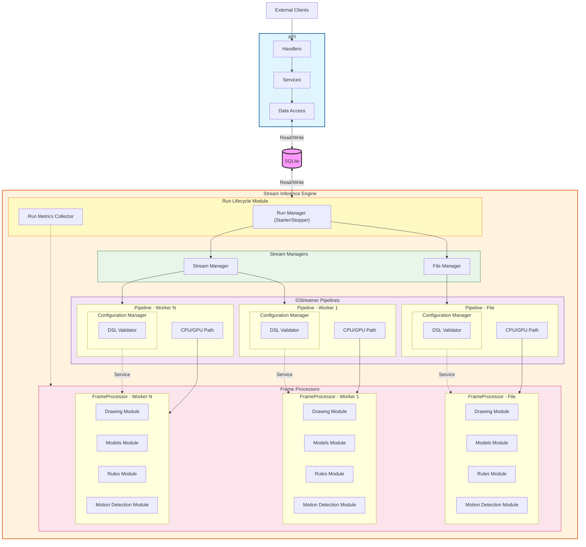

# Arquitectura

Esta sección describe la descomposición estructural del sistema en módulos conceptuales, el flujo de datos y control entre ellos, y los mecanismos de comunicación utilizados. Define las dependencias externas críticas (hardware, drivers y frameworks), los límites actuales de escalabilidad bajo el hardware objetivo y las métricas consideradas para evaluar comportamiento. También delimita el grado de extensibilidad de los componentes y el modelo de ownership dentro del alcance del MVP.

## Módulos conceptuales
- API: Comunicación con desarrolladores y otros servicios, validación básica de configuraciones y pesos, administración de base de datos.
- Engine: Orquestador de submódulos, interactúa con la base de datos mediante polling.
- Configuration Validation: Interpreta argumentos del YAML, enlaza templates, contiene el compilador DSL de reglas de inferencia, genera clases que ejecutan reglas por frame.
- Metrics: Monitorea recursos del sistema y reporta resultados a la base de datos.
- Processing: Orquesta detección de movimiento, inferencia de modelos, dibujado de frames y ejecución de reglas.
- Evaluador de reglas: Ejecuta reglas a partir de los resultados de inferencia (orquestado por Processing).
- Módulo de dibujado: Dibuja y genera metadatos sobre frames según resultados de inferencia y evaluación de reglas (orquestado por Processing).
- Módulo de modelos: Gestiona carga de pesos y arquitecturas de modelos, valida configuraciones y clases a detectar o segmentar.
- Stream y File Manager: Ejecuta procesos de inferencia sobre streams o archivos, crea pipelines de GPU/CPU, levanta el servidor RTSP, sirve al Engine.
- Transforms: Puente entre Processing y Stream/File Manager, permite el paso de frames entre pipelines.
- Flujo de datos conceptual: Los frames y resultados de inferencia fluyen del Stream/File Manager → Transform → Processing (incluyendo dibujado y reglas) → Transform → Stream/File Manager → Server RTSP. La API y la base de datos actúan como mediadores de control y configuración.

---

## Flujo de control y comunicación
- Los módulos se comunican mediante llamadas a métodos conceptuales entre ellos.
- Stream Manager utiliza IPC (stdin/stdout) y memoria compartida (shmsink/shmsrc) para coordinar pipelines que corren en procesos separados. Los Transforms procesan frames directamente dentro del mismo proceso mediante llamadas al FrameProcessor.
- API y Engine se comunican exclusivamente a través de la base de datos.
- Todos los módulos deben funcionar correctamente para ejecutar un run; si alguno falla, el run no se completa.

---

## Dependencias externas y hardware
- Dependencia fuerte de arquitectura GPU: Tesla V100, NVIDIA T4, Jetson.
- Librerías y frameworks requeridos: CUDA 12.6, cuDNN, DeepStream 7.1, pyds, GStreamer plugins, drivers NVIDIA específicos, YOLO, PyTorch, TensorRT.
- API y Engine dependen de la base de datos (actualmente local).
- Módulos dependen del hardware disponible para cumplir con rendimiento esperado.

---

## Escalabilidad y límites conceptuales
- Límite actual: 6 streams 1080p con inferencia full-frame usando modelo YOLO nano.
- Potencial estimado: ~10 streams con optimización de recursos y sin escalar hardware.
- Consumo actual para 6 streams: 16GB RAM, <12GB VRAM, GPU Tesla V100, CPU 6 núcleos.
- Escalar mediante más hardware es más rápido pero costoso; optimización de código puede mejorar eficiencia sin aumentar recursos.

---

## Métricas conceptuales
- Se mide framedrop rate, latencia end-to-end y latencia de procesamiento.
- Pipeline 2 mide solo latencia end-to-end, framedrop no es representativo.
- La medición real es limitada debido a la pérdida de identidad de frames entre pipelines.
- Futuras mejoras: agregar metadata por frame para trazabilidad entre pipelines y medición precisa de throughput y latencia.

---

## Extensibilidad y ownershipa
- Módulos como validación de reglas, evaluación de reglas, carga de modelos y dibujado son extensibles, aunque requieren intervención de un desarrollador.
- Engine orquesta todos los módulos; API desacopla casi totalmente la interacción mediante la base de datos.
- Diseño conceptual permite escalar y modificar funcionalidades sin afectar otros módulos, respetando límites del MVP.
