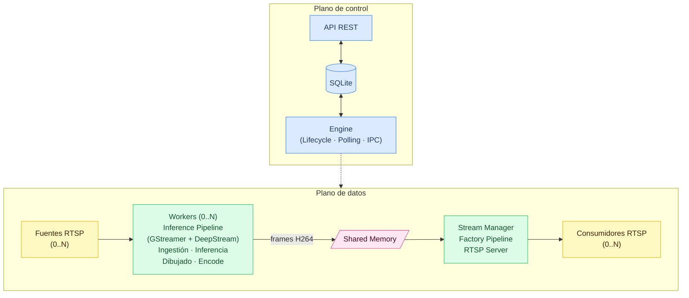

# Arquitectura

Esta sección describe la descomposición estructural del sistema en módulos conceptuales, el flujo de datos y control entre ellos, y los mecanismos de comunicación utilizados. Define las dependencias externas críticas (hardware, drivers y frameworks), los límites actuales de escalabilidad bajo el hardware objetivo y las métricas consideradas para evaluar comportamiento. También delimita el grado de extensibilidad de los componentes y el modelo de ownership dentro del alcance del MVP.

## Módulos conceptuales

El sistema se organiza en dos planos: control y datos.

**Plano de control**
- **API**: Interfaz hacia otros servicios. Gestiona configuraciones, pesos de modelos y persistencia en base de datos.
- **Engine**: Orquestador central. Gestiona el ciclo de vida de los runs mediante polling en la base de datos y coordina Workers y Stream Manager vía IPC.
- **Base de datos**: Mediador de estado entre API y Engine.

**Plano de datos**
- **Workers (0..N)**: Procesos independientes, uno por stream activo. Cada Worker ejecuta un Inference Pipeline que ingesta la fuente RTSP, aplica inferencia y dibujado sobre los frames, los codifica en H264 y los escribe en memoria compartida.
- **Shared Memory**: Mecanismo de transferencia de frames entre Workers y Stream Manager.
- **Stream Manager**: Proceso central del plano de datos. Contiene el Factory Pipeline, que lee frames desde memoria compartida y los publica a través del servidor RTSP.

---

## Flujo de control y comunicación
- API y Engine se comunican exclusivamente a través de la base de datos.
- Engine coordina Workers y Stream Manager mediante IPC (stdin/stdout) con mensajes JSON.
- Los frames procesados se transfieren entre Workers y Stream Manager a través de memoria compartida.
- Todos los componentes deben estar operativos para ejecutar un run; si alguno falla, el run no se completa.

---

## Dependencias externas y hardware
- Dependencia fuerte de arquitectura GPU: Tesla V100, NVIDIA T4, Jetson.
- Librerías y frameworks requeridos: CUDA 12.6, cuDNN, DeepStream 7.1, pyds, GStreamer plugins, drivers NVIDIA específicos, YOLO, PyTorch, TensorRT.
- API y Engine dependen de la base de datos (actualmente local).
- Módulos dependen del hardware disponible para cumplir con rendimiento esperado.

---

## Escalabilidad y límites conceptuales
- Límite actual: 6 streams 1080p con inferencia full-frame usando modelo YOLO nano.
- Potencial estimado: ~10 streams con optimización de recursos y sin escalar hardware.
- Consumo actual para 6 streams: 16GB RAM, <12GB VRAM, GPU Tesla V100, CPU 6 núcleos.
- Escalar mediante más hardware es más rápido pero costoso; optimización de código puede mejorar eficiencia sin aumentar recursos.

---

## Métricas conceptuales
- Se mide framedrop rate, latencia end-to-end y latencia de procesamiento.
- El Factory Pipeline mide solo latencia end-to-end; el framedrop no es representativo dado que re-consume los mismos frames desde memoria compartida.
- La medición real es limitada debido a la pérdida de identidad de frames entre pipelines.
- Futuras mejoras: agregar metadata por frame para trazabilidad entre pipelines y medición precisa de throughput y latencia.

---

## Extensibilidad y ownership
- Módulos como validación de reglas, evaluación de reglas, carga de modelos y dibujado son extensibles, aunque requieren intervención de un desarrollador.
- Engine orquesta todos los módulos; API desacopla casi totalmente la interacción mediante la base de datos.
- Diseño conceptual permite escalar y modificar funcionalidades sin afectar otros módulos, respetando límites del MVP.
